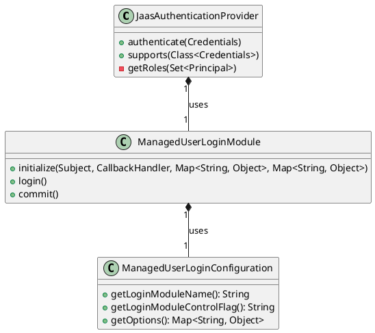

# Role-Based Access Control in JAAS Authentication

This document describes how Role-Based Access Control (RBAC) is implemented in the openHAB JAAS authentication system.

## Overview

The JAAS authentication provider integrates RBAC by:
- Mapping JAAS principals to openHAB roles
- Supporting role-based authentication
- Providing role persistence
- Enabling dynamic role assignment

## Components



## Role Mapping

The JAAS provider maps principals to roles:

```java
private Role[] getRoles(Set<Principal> principals) {
    Set<Role> roles = new HashSet<>();
    for (Principal principal : principals) {
        roles.add(new RoleImpl(principal.getName()));
    }
    return (Role[]) roles.toArray();
}
```

## Login Module Configuration

The login module supports role-based authentication:

```java
public class ManagedUserLoginModule implements LoginModule {
    private Subject subject;
    private Set<Principal> principals;
    
    @Override
    public boolean login() throws LoginException {
        // Authentication logic
        // Role assignment
    }
}
```

## Role Persistence

Roles are persisted through the `ManagedUserProvider`:

```java
public class ManagedUserProvider implements UserProvider {
    private final RoleRegistry roleRegistry;
    
    public void setRoles(String username, Set<Role> roles) {
        // Role persistence logic
    }
}
```

## Security Considerations

1. Role changes require re-authentication
2. JAAS principals are mapped to openHAB roles
3. Role information is persisted securely
4. Login module configuration is protected

## Usage Examples

### Configuring JAAS with Roles

```java
JaasAuthenticationProvider provider = new JaasAuthenticationProvider();
provider.setRealmName("openhab");
```

### Role Assignment During Login

```java
Set<Principal> principals = new HashSet<>();
principals.add(new RolePrincipal("administrator"));
subject.getPrincipals().addAll(principals);
```

## Integration with Core RBAC

The JAAS provider integrates with the core RBAC system through:

1. Role mapping from principals
2. Role persistence in the registry
3. Role-based authentication
4. Security context management

## Future Enhancements

1. Dynamic role assignment during login
2. Role-based session management
3. Enhanced role validation
4. Role-based audit logging 