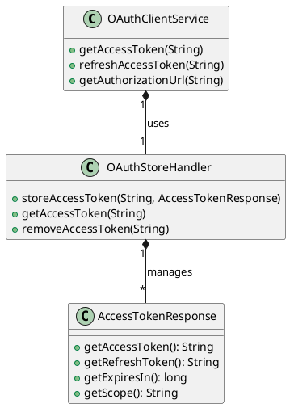

# Role-Based Access Control in OAuth2 Client

This document describes how Role-Based Access Control (RBAC) is implemented in the openHAB OAuth2 client authentication system.

## Overview

The OAuth2 client system integrates RBAC by:
- Mapping OAuth2 scopes to openHAB roles
- Supporting role-based token management
- Providing role persistence
- Enabling dynamic role assignment

## Components



## Scope to Role Mapping

The OAuth2 client maps scopes to roles:

```java
private Set<Role> mapScopesToRoles(String scope) {
    Set<Role> roles = new HashSet<>();
    String[] scopes = scope.split(" ");
    for (String s : scopes) {
        roles.add(new RoleImpl(s));
    }
    return roles;
}
```

## Token Management

Access tokens include role information:

```java
public class AccessTokenResponse {
    private String accessToken;
    private String refreshToken;
    private long expiresIn;
    private String scope;
    
    public Set<Role> getRoles() {
        return mapScopesToRoles(scope);
    }
}
```

## Role Persistence

Roles are persisted with tokens:

```java
public class OAuthStoreHandler {
    private final RoleRegistry roleRegistry;
    
    public void storeAccessToken(String clientId, AccessTokenResponse token) {
        // Store token
        // Store associated roles
    }
}
```

## Security Considerations

1. Role changes require token refresh
2. OAuth2 scopes are mapped to openHAB roles
3. Role information is persisted securely
4. Token storage is encrypted

## Usage Examples

### Configuring OAuth2 with Roles

```java
OAuthClientService service = new OAuthClientService();
service.setScope("read write admin");
```

### Role Assignment During Token Refresh

```java
AccessTokenResponse token = service.refreshAccessToken(clientId);
Set<Role> roles = token.getRoles();
```

## Integration with Core RBAC

The OAuth2 client integrates with the core RBAC system through:

1. Scope to role mapping
2. Role persistence in the registry
3. Role-based token management
4. Security context management

## Future Enhancements

1. Dynamic scope to role mapping
2. Role-based token refresh
3. Enhanced role validation
4. Role-based audit logging 