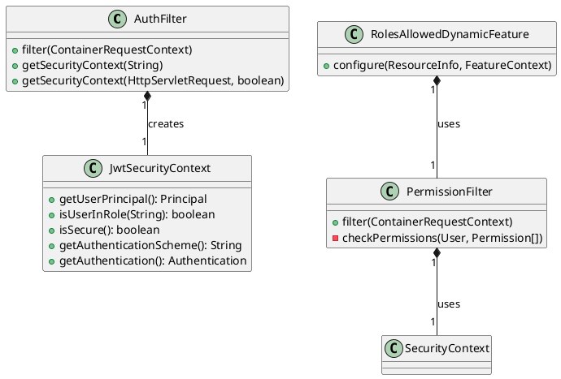

# Role-Based Access Control in REST Authentication

This document describes how Role-Based Access Control (RBAC) is implemented in the openHAB REST authentication system.

## Overview

The REST authentication system integrates RBAC through:
- JWT token-based authentication
- Role-based authorization headers
- Permission-based endpoint access control
- Security context management

## Components



## JWT Token Integration

The JWT token system has been enhanced to include role information:

```java
// Token Generation
jwtClaims.setStringListClaim("role", roleStrings);

// Token Verification
List<String> roleStrings = jwtClaims.getStringListClaimValue("role");
Set<Role> roles = new HashSet<>();
for (String role : roleStrings) {
    roles.add(new RoleImpl(role));
}
```

## Security Context Implementation

The `JwtSecurityContext` class provides role-based security context:

```java
@Override
public boolean isUserInRole(@Nullable String role) {
    return authentication.getRoles().contains(role);
}
```

## Permission-Based Access Control

The `PermissionFilter` enforces permissions on REST endpoints:

```java
@RequiresPermission("read_items")
@GET
public List<Item> getItems() {
    // Implementation
}
```

## Role-Based Authorization

The `RolesAllowedDynamicFeature` provides role-based authorization:

```java
@RolesAllowed("administrator")
@POST
public void updateSystem() {
    // Implementation
}
```

## WebSocket Integration

WebSocket connections are secured with role checks:

```java
private boolean isAuthorizedRequest(String bearerToken) {
    var securityContext = authFilter.getSecurityContext(bearerToken);
    return securityContext != null
            && (securityContext.isUserInRole(Role.USER) 
                || securityContext.isUserInRole(Role.ADMIN));
}
```

## Security Considerations

1. JWT tokens include role information
2. Role changes require new token generation
3. Permissions are checked at both endpoint and method levels
4. WebSocket connections maintain role-based security

## Usage Examples

### Securing REST Endpoints

```java
@Path("/items")
public class ItemResource {
    @RequiresPermission("read_items")
    @GET
    public List<Item> getItems() {
        // Implementation
    }

    @RequiresPermission("write_items")
    @POST
    public void createItem(Item item) {
        // Implementation
    }
}
```

### Role-Based Access Control

```java
@RolesAllowed("administrator")
@Path("/system")
public class SystemResource {
    @POST
    public void updateSystem() {
        // Implementation
    }
}
```

## Future Enhancements

1. Token refresh with role updates
2. Role-based rate limiting
3. Enhanced audit logging
4. Role-based caching 