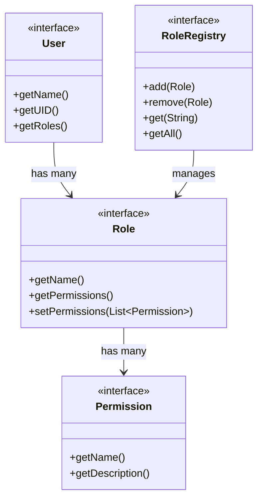
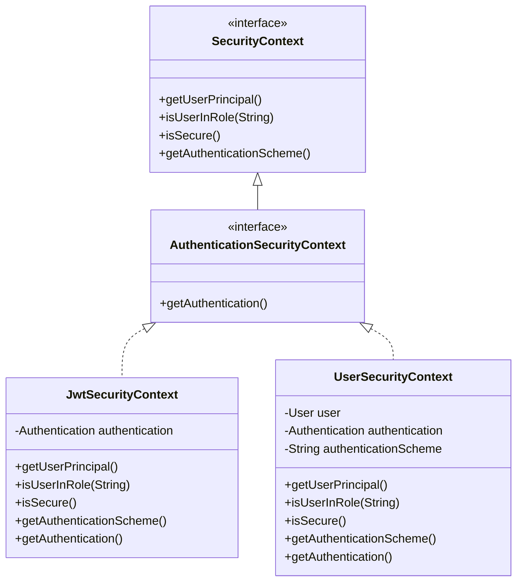
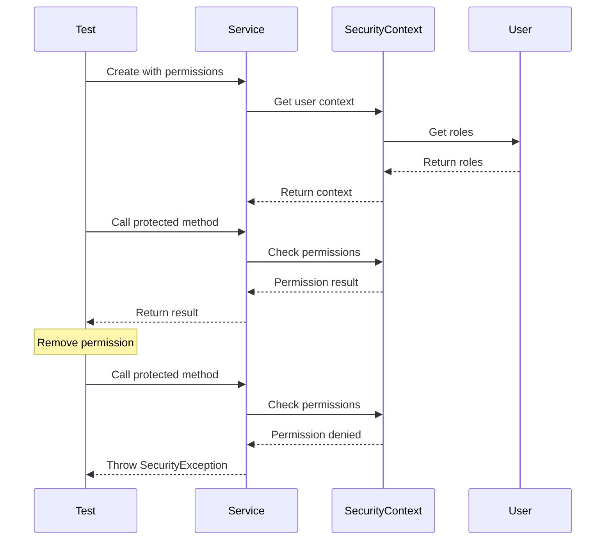
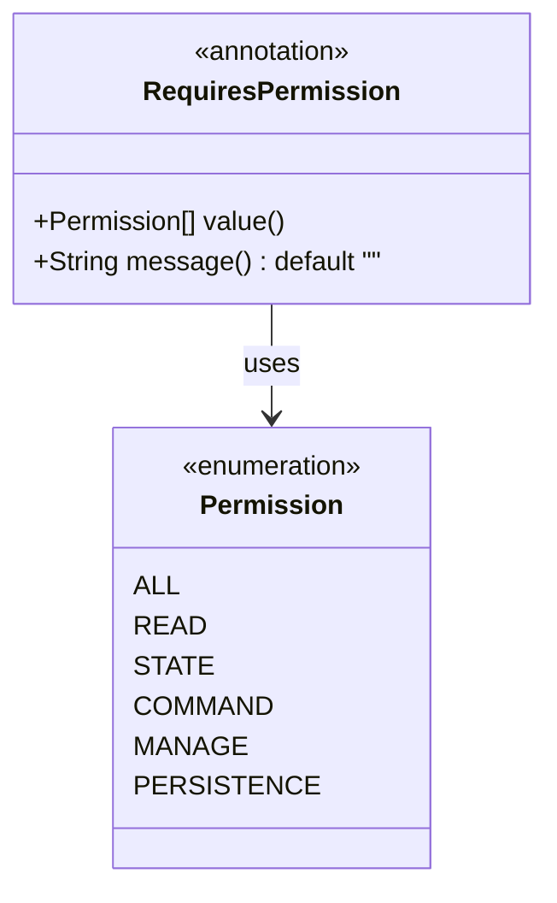
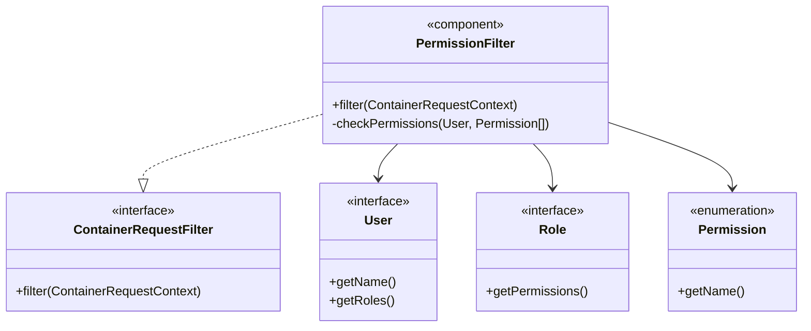
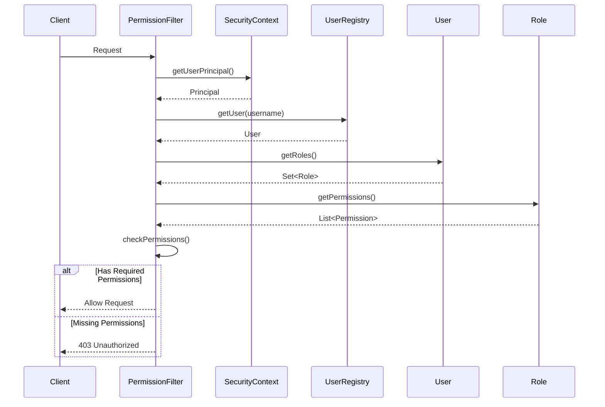

# RBAC Development Guide

## Table of Contents

1. [API Overview](#api-overview)
   - [Core Interfaces](#core-interfaces)
   - [Security Context](#security-context)
2. [Testing Guidelines](#testing-guidelines)
   - [Unit Testing](#unit-testing)
   - [Integration Testing](#integration-testing)
3. [Migration Guide](#migration-guide)
   - [From JAX-RS Role Definitions](#from-jax-rs-role-definitions)
4. [Best Practices](#best-practices)
   - [Permission Implementation](#permission-implementation)
   - [Role Management](#role-management)
5. [Common Patterns](#common-patterns)
   - [Permission Annotations](#permission-annotations)
   - [Permission Filter](#permission-filter)
   - [Usage Flow](#usage-flow)

## API Overview

### Core Interfaces

The core RBAC interfaces define the fundamental components of the permission system. See the following source files for full implementations:

- [User.java](src/main/java/org/openhab/core/auth/User.java)
- [Role.java](src/main/java/org/openhab/core/auth/Role.java)
- [Permission.java](src/main/java/org/openhab/core/auth/Permission.java)
- [RoleRegistry.java](src/main/java/org/openhab/core/auth/RoleRegistry.java)



### Security Context

The JAX-RS `SecurityContext` interface (`javax.ws.rs.core.SecurityContext`) provides access to the current user's security information in REST endpoints. Our RBAC system integrates with this interface through several implementations:

1. **JwtSecurityContext**
   - Implements JAX-RS SecurityContext for JWT-based authentication
   - Provides user information from JWT tokens
   - Used for stateless authentication

2. **UserSecurityContext**
   - Implements JAX-RS SecurityContext for user-based authentication
   - Provides user information from User objects
   - Used for session-based authentication

3. **AuthenticationSecurityContext**
   - Extends JAX-RS SecurityContext with Authentication support
   - Base interface for both JWT and User security contexts
   - Provides access to Authentication objects



Example usage in a REST resource:
```java
@Path("/items")
public class ItemResource {
    @Context
    SecurityContext securityContext;
    
    @GET
    @RequiresPermission(Permissions.READ)
    public List<Item> getItems() {
        // Implementation
    }
}
```

## Testing Guidelines

### Unit Testing

The RBAC system requires comprehensive unit tests. The following test classes need to be developed:

1. **PermissionTest**
   - Test permission hierarchy and relationships
   - Test permission comparison and equality
   - Test permission string representation

2. **RoleTest**
   - Test role creation and validation
   - Test permission assignment and removal
   - Test role comparison and equality

3. **UserTest**
   - Test user creation and validation
   - Test role assignment and removal
   - Test user comparison and equality

4. **SecurityContextTest**
   - Test permission checking
   - Test role checking
   - Test user information access

Example test structure:
```java
@Test
public void testPermissionCheck() {
    // Create test user with permission
    User user = createTestUser(Permissions.READ.getPermission());
    SecurityContext context = new SecurityContext(user);

    // Test permission check
    assertTrue(context.hasPermission(Permissions.READ.getPermission()));
    assertFalse(context.hasPermission(Permissions.COMMAND.getPermission()));
}
```

### Integration Testing

Integration tests need to be developed to verify the complete RBAC flow. The following test scenarios should be covered:

1. **Authentication Flow**
   - Test JWT token validation
   - Test user authentication
   - Test anonymous access

2. **Permission Enforcement**
   - Test permission checking in REST endpoints
   - Test permission inheritance
   - Test multiple permission requirements

3. **Role Management**
   - Test role assignment
   - Test permission propagation
   - Test role hierarchy

4. **Security Context Integration**
   - Test SecurityContext creation
   - Test user principal access
   - Test role checking



### Test Requirements

1. **Coverage**
   - All public methods should be tested
   - Edge cases and error conditions should be covered
   - Security-critical paths must be verified

2. **Isolation**
   - Tests should be independent
   - No shared state between tests
   - Clean setup and teardown

3. **Security**
   - Test permission bypass attempts
   - Test role elevation attempts
   - Test authentication failures

4. **Performance**
   - Test with large numbers of roles
   - Test with complex permission hierarchies
   - Test concurrent access patterns

## Migration Guide

### From JAX-RS Role Definitions

1. Update Permission Annotations
```java
// Old way - JAX-RS role definitions
@RolesAllowed("admin")
public void oldMethod() {
    // Implementation
}

// New way - Custom @RequiresPermission aspect
@RequiresPermission(Permissions.MANAGE)
public void newMethod() {
    // Implementation
}
```

2. Update Role Creation
```java
// Old way - Hardcoded role strings
Role role = new Role("admin", Arrays.asList("manage"));

// New way - Using Permission enum
Role role = new RoleImpl("admin", 
    Collections.singletonList(Permissions.MANAGE.getPermission()));
```

3. Update Permission Checking
```java
// Old way - Role-based checks
if (hasRole("admin")) {
    // Implementation
}

// New way - Permission-based checks
if (securityContext.hasPermission(Permissions.MANAGE.getPermission())) {
    // Implementation
}
```

## Best Practices

### Permission Implementation

1. Naming Conventions
   - Use standard permission names
   - Follow permission hierarchy
   - Use descriptive combinations

2. Documentation
   - Document permission usage
   - Include usage examples
   - Specify dependencies

3. Testing
   - Unit test permissions
   - Integration test access
   - Security test validation

### Role Management

1. Role Creation
   - Use meaningful names
   - Group related permissions
   - Document purpose

2. Role Assignment
   - Follow least privilege
   - Regular review
   - Monitor usage

3. Security
   - Validate inputs
   - Handle errors
   - Log changes

## Common Patterns

### Permission Annotations

The `@RequiresPermission` annotation is used to declare permission requirements on methods. See [RequiresPermission.java](src/main/java/org/openhab/core/auth/RequiresPermission.java) for the full implementation.



Example usage:
```java
@RequiresPermission(Permissions.READ)
public Item getItem(String name) {
    // Implementation
}

@RequiresPermission({ Permissions.READ, Permissions.STATE })
public void updateItemState(String name, State state) {
    // Implementation
}
```

### Permission Filter

The `PermissionFilter` is responsible for enforcing permission requirements. See [PermissionFilter.java](src/main/java/org/openhab/core/auth/PermissionFilter.java) for the full implementation.



### Usage Flow

