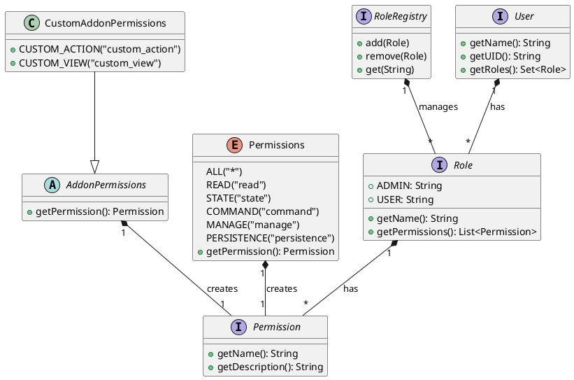

# RBAC Overview and Architecture

## System Overview

The RBAC implementation in openHAB core provides a flexible and extensible way to manage user permissions through roles. The system follows a hierarchical model where:

1. Users have roles
2. Roles have permissions
3. Permissions control access to resources
4. The system enforces permissions through filters and annotations

## Core Components

## Component Descriptions

### User
- Represents a system user
- Contains a set of roles
- Provides user identification and role access

### Role
- Defines a set of permissions
- Has reserved names ("administrator" and "user")
- Can be assigned to multiple users

### Permission
- Represents a specific access right
- Has a name and description
- Can be standard or addon-specific

### RoleRegistry
- Manages role creation and lookup
- Maintains the set of available roles
- Provides role management operations

## Integration Points

### Authentication Providers
- JAAS Authentication
- OAuth2 Authentication
- Custom authentication providers

### REST Layer
- REST endpoint security
- Resource access control
- API permission enforcement

### WebSocket
- Real-time communication security
- Connection permission validation
- Event subscription control

### Security Context
- Thread-local security information
- Permission checking context
- User session management

## System Flow

1. User Authentication
   - User credentials are validated
   - User roles are loaded
   - Security context is established

2. Permission Checking
   - Method/class annotations are processed
   - User roles are checked
   - Permission hierarchy is validated

3. Access Control
   - Resource access is granted/denied
   - Security context is maintained
   - Audit events are logged

## Design Principles

1. Extensibility
   - Support for custom permissions
   - Plugin architecture for addons
   - Flexible role management

2. Security
   - Principle of least privilege
   - Role-based access control
   - Permission hierarchy

3. Usability
   - Simple permission model
   - Clear role structure
   - Intuitive API

4. Performance
   - Efficient permission checking
   - Cached security contexts
   - Optimized role lookups 