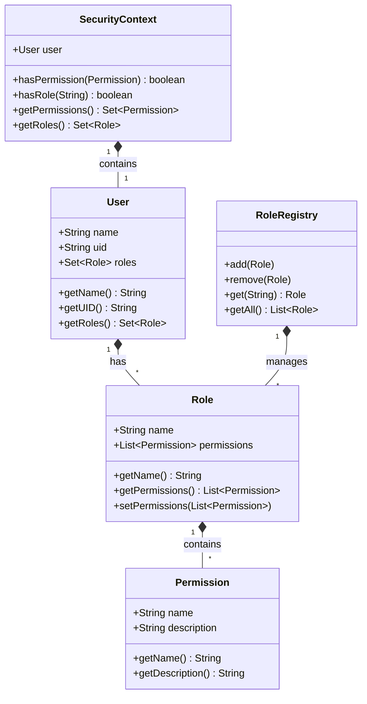

# Role-Based Access Control (RBAC) Overview

## System Architecture

The RBAC system in openHAB Core provides a comprehensive security framework for managing user access and permissions. The system is built on several key components that work together to enforce security policies.



## Core Components

### User
- Represents an authenticated user in the system
- Has a unique identifier (UID) and display name
- Associated with one or more roles
- Used for authentication and authorization

### Role
- Defines a set of permissions
- Can be assigned to users
- Provides a way to group related permissions
- Supports dynamic permission updates

### Permission
- Represents a specific access right
- Has a name and description
- Used to control access to system resources
- Standard permissions are defined in the `Permissions` enum

### RoleRegistry
- Central management point for roles
- Handles role creation and deletion
- Maintains role assignments
- Provides role lookup functionality

### SecurityContext
- Thread-local security information
- Contains current user and permissions
- Used for permission checking
- Provides role validation

## Integration Points

### REST API
- Uses `@RequiresPermission` annotation
- Integrates with JWT authentication
- Supports role-based access control
- Handles permission validation

### Authentication
- Works with JAAS authentication
- Supports OAuth2 client integration
- Manages user sessions
- Handles security tokens

### Authorization
- Enforces permission checks
- Validates role assignments
- Manages access control
- Handles security exceptions

## Security Features

### Permission Checking
```java
@RequiresPermission(Permissions.READ)
public void readItem() {
    // Implementation
}
```

### Role Assignment
```java
Role role = new RoleImpl("customRole", 
    Collections.singletonList(Permissions.READ.getPermission()));
```

### Security Context
```java
SecurityContext context = SecurityContextHolder.getContext();
if (context.hasPermission(Permissions.READ.getPermission())) {
    // Perform protected operation
}
```

## Future Enhancements

1. Dynamic Role Management
   - Runtime role creation
   - Permission inheritance
   - Role hierarchies

2. Enhanced Security
   - Permission caching
   - Role validation
   - Access logging

3. Integration Features
   - LDAP integration
   - OAuth2 provider support
   - Custom authentication

## Related Documentation

- [Permissions System](RBAC-Permissions.md)
- [Roles and Users](RBAC-Roles.md)
- [Security Implementation](RBAC-Security.md)
- [Development Guide](RBAC-Development.md) 