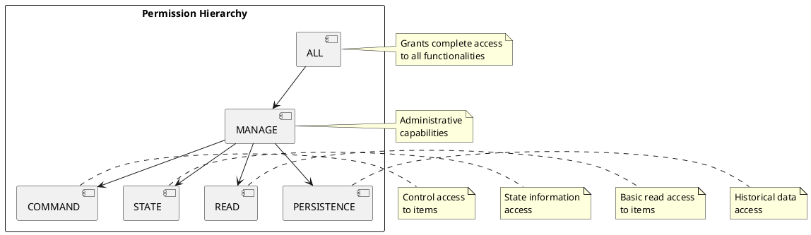

# RBAC Permissions System

## Standard Permissions

The system defines a set of standard permissions in the `Permissions` enum that control access to various system functionalities:

### ALL
- Symbol: `*`
- Description: Grants complete access to all functionalities
- Use case: Administrator-level access
- Hierarchy: Top level

### READ
- Symbol: `read`
- Description: Allows reading item states and metadata
- Use case: View-only access to items
- Hierarchy: Basic access

### STATE
- Symbol: `state`
- Description: Permits access to item state information
- Use case: Monitoring item states
- Hierarchy: Basic access

### COMMAND
- Symbol: `command`
- Description: Enables sending commands to items
- Use case: Controlling items
- Hierarchy: Control access

### MANAGE
- Symbol: `manage`
- Description: Grants administrative capabilities like creating/updating items
- Use case: System configuration
- Hierarchy: Administrative access

### PERSISTENCE
- Symbol: `persistence`
- Description: Controls access to persistence services
- Use case: Historical data access
- Hierarchy: Data access

## Permission Hierarchy



## Permission Best Practices

### Naming Conventions
1. Use standard permission names
2. Follow permission hierarchy
3. Use descriptive permission combinations
4. Document permission usage

### Documentation
1. Document each permission's purpose
2. Include usage examples
3. Specify permission hierarchy
4. Document dependencies

### Implementation
1. Use enum for permissions
2. Implement proper permission checking
3. Handle permission inheritance
4. Follow least privilege principle

## Permission Usage Examples

### Basic Permission Check
```java
@RequiresPermission(Permissions.READ)
public void readItemState() {
    // Method implementation
}
```

### Multiple Permission Check
```java
@RequiresPermission({ Permissions.READ, Permissions.STATE })
public void readItemStateWithHistory() {
    // Method implementation
}
```

## Permission Validation

### Method Level
```java
@RequiresPermission(Permissions.COMMAND)
public void sendCommand(Command command) {
    // Method implementation
}
```

### Class Level
```java
@RequiresPermission(Permissions.MANAGE)
public class ItemManagementService {
    // Class implementation
}
```

### Dynamic Permission Check
```java
public boolean hasPermission(Permission permission) {
    return securityContext.getUser().getRoles().stream()
        .flatMap(role -> role.getPermissions().stream())
        .anyMatch(p -> p.equals(permission));
}
``` 