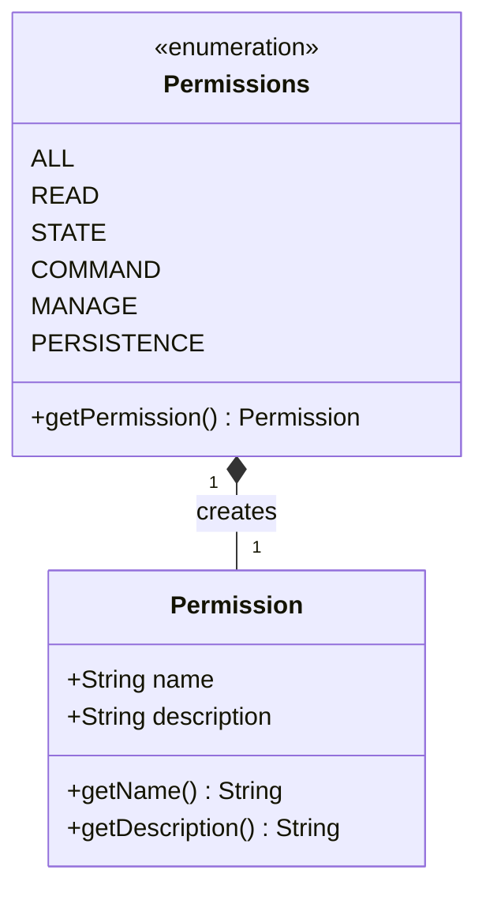

# RBAC Permissions System

## Overview

The permissions system in openHAB Core provides a standardized way to control access to system resources. The system is built around the `Permissions` enum which defines the standard set of permissions available in the system.

## Standard Permissions



### Permission Types

1. `ALL` ("*")
   - Grants complete access to all resources
   - Used for administrative roles
   - Implies all other permissions

2. `READ` ("read")
   - Allows reading resource values
   - Basic access for viewing items
   - Required for most operations

3. `STATE` ("state")
   - Controls access to item states
   - Allows reading and writing states
   - Required for item updates

4. `COMMAND` ("command")
   - Permits sending commands to items
   - Required for item control
   - Implies READ permission

5. `MANAGE` ("manage")
   - Allows system configuration
   - Required for administrative tasks
   - Implies COMMAND permission

6. `PERSISTENCE` ("persistence")
   - Controls data persistence access
   - Required for historical data
   - Implies READ permission

## Usage Examples

### Method-Level Permissions

```java
@RequiresPermission(Permissions.READ)
public Item getItem(String name) {
    // Implementation
}

@RequiresPermission({ Permissions.READ, Permissions.STATE })
public void updateItemState(String name, State state) {
    // Implementation
}
```

### Role Creation

```java
Role role = new RoleImpl("customRole", Arrays.asList(
    Permissions.READ.getPermission(),
    Permissions.STATE.getPermission()
));
```

### Permission Checking

```java
SecurityContext context = SecurityContextHolder.getContext();
if (context.hasPermission(Permissions.READ.getPermission())) {
    // Perform read operation
}
```

## Best Practices

1. Permission Usage
   - Use standard permissions
   - Follow permission hierarchy
   - Use descriptive combinations

2. Security
   - Principle of least privilege
   - Regular permission review
   - Audit access patterns

3. Documentation
   - Document permission usage
   - Include usage examples
   - Specify dependencies

## Related Documentation

- [RBAC Overview](RBAC-Overview.md)
- [Roles and Users](RBAC-Roles.md)
- [Security Implementation](RBAC-Security.md)
- [Development Guide](RBAC-Development.md) 