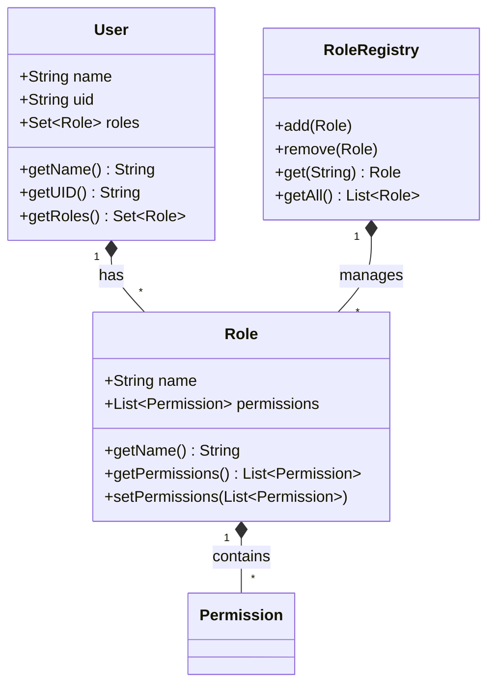

# RBAC Roles and Users

## Overview

The roles and users system in openHAB Core provides a flexible way to manage user access through role assignments. The system supports both predefined and custom roles, with each role containing a set of permissions that define its capabilities.

## Role Structure



## Standard Roles

### Administrator
- Has ALL permissions
- Full system access
- Can manage users and roles
- System configuration access

### User
- Basic access permissions
- READ and STATE permissions
- Limited system access
- No administrative rights

## Role Management

### Creating Roles

```java
Role role = new RoleImpl("customRole", Arrays.asList(
    Permissions.READ.getPermission(),
    Permissions.STATE.getPermission()
));
roleRegistry.add(role);
```

### Assigning Roles

```java
User user = new UserImpl("username", "uid");
user.getRoles().add(role);
```

### Role Validation

```java
public void validateRole(Role role) {
    if (role.getName() == null || role.getName().trim().isEmpty()) {
        throw new IllegalArgumentException("Role name cannot be empty");
    }
    
    if (role.getName().equals("administrator") || 
        role.getName().equals("user")) {
        throw new IllegalArgumentException("Cannot use reserved role name");
    }
    
    if (role.getPermissions() == null || role.getPermissions().isEmpty()) {
        throw new IllegalArgumentException("Role must have at least one permission");
    }
}
```

## User Management

### User Creation

```java
User user = new UserImpl("username", "uid");
user.getRoles().add(roleRegistry.get("user"));
```

### Role Assignment

```java
public void assignRole(User user, String roleName) {
    Role role = roleRegistry.get(roleName);
    if (role == null) {
        throw new IllegalArgumentException("Role not found: " + roleName);
    }
    user.getRoles().add(role);
}
```

### Permission Checking

```java
public boolean hasPermission(User user, Permission permission) {
    return user.getRoles().stream()
        .flatMap(role -> role.getPermissions().stream())
        .anyMatch(p -> p.equals(permission));
}
```

## Best Practices

1. Role Design
   - Use meaningful names
   - Group related permissions
   - Follow least privilege
   - Document purpose

2. User Management
   - Regular role review
   - Monitor role usage
   - Audit role changes
   - Validate assignments

3. Security
   - Protect role registry
   - Validate role names
   - Check permission sets
   - Handle errors

## Related Documentation

- [RBAC Overview](RBAC-Overview.md)
- [Permissions System](RBAC-Permissions.md)
- [Security Implementation](RBAC-Security.md)
- [Development Guide](RBAC-Development.md) 