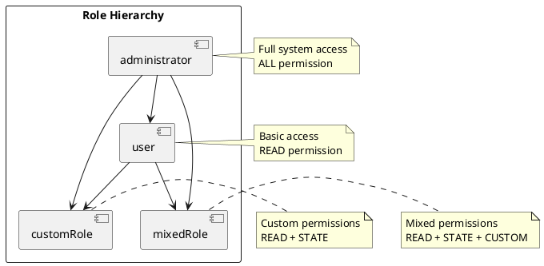

# RBAC Roles and Users

## Role Management

### Reserved Roles

The system defines two reserved roles that cannot be modified or deleted:

1. `administrator`
   - Full system access
   - Cannot be modified
   - Cannot be deleted
   - Has ALL permission

2. `user`
   - Basic user access
   - Cannot be modified
   - Cannot be deleted
   - Has READ permission

### Creating Roles

```java
// Create a new role with standard permissions
Role newRole = new RoleImpl("customRole", Arrays.asList(
    Permissions.READ.permission,
    Permissions.STATE.permission
));

// Create a role with mixed permissions
Role mixedRole = new RoleImpl("mixedRole", Arrays.asList(
    Permissions.READ.permission,
    Permissions.STATE.permission,
    CustomAddonPermissions.CUSTOM_ACTION.permission
));

// Add role to registry
roleRegistry.add(newRole);
```

### Role Operations

```java
// Get a role
Role role = roleRegistry.get("customRole");

// Remove a role
roleRegistry.remove("customRole");

// Update role permissions
role.setPermissions(Arrays.asList(
    Permissions.READ.permission,
    Permissions.STATE.permission,
    Permissions.COMMAND.permission
));
```

## User-Role Mapping

### User Registration

```java
// Create a new user with roles
Set<Role> roles = new HashSet<>();
roles.add(roleRegistry.get("customRole"));
userRegistry.register(username, password, roles);

// Add roles to existing user
User user = userRegistry.get(username);
user.getRoles().add(roleRegistry.get("customRole"));

// Remove roles from user
user.getRoles().remove(roleRegistry.get("customRole"));
```

### Role Assignment

```java
// Assign multiple roles
Set<Role> userRoles = new HashSet<>();
userRoles.add(roleRegistry.get("customRole"));
userRoles.add(roleRegistry.get("mixedRole"));
user.setRoles(userRoles);

// Check user roles
boolean hasRole = user.getRoles().contains(roleRegistry.get("customRole"));

// Get user permissions
Set<Permission> userPermissions = user.getRoles().stream()
    .flatMap(role -> role.getPermissions().stream())
    .collect(Collectors.toSet());
```

## Role Hierarchy



## Role Management Best Practices

### Role Creation
1. Use descriptive role names
2. Follow least privilege principle
3. Group related permissions
4. Document role purpose

### Role Assignment
1. Assign minimum required roles
2. Review role assignments regularly
3. Monitor role usage
4. Maintain role documentation

### Security Considerations
1. Role names are case-sensitive
2. Reserved roles cannot be modified
3. Role changes require re-authentication
4. Monitor role changes

## Role Validation

### Role Existence Check
```java
public boolean roleExists(String roleName) {
    return roleRegistry.get(roleName) != null;
}
```

### Role Permission Check
```java
public boolean roleHasPermission(String roleName, Permission permission) {
    Role role = roleRegistry.get(roleName);
    return role != null && role.getPermissions().contains(permission);
}
```

### User Role Check
```java
public boolean userHasRole(String username, String roleName) {
    User user = userRegistry.get(username);
    return user != null && user.getRoles().contains(roleRegistry.get(roleName));
}
```

## Role Management UI

### Role List View
```java
public List<RoleDTO> getAllRoles() {
    return roleRegistry.getAll().stream()
        .map(role -> new RoleDTO(
            role.getName(),
            role.getPermissions().stream()
                .map(Permission::getName)
                .collect(Collectors.toList())
        ))
        .collect(Collectors.toList());
}
```

### Role Creation Form
```java
public Role createRole(RoleDTO roleDTO) {
    List<Permission> permissions = roleDTO.getPermissions().stream()
        .map(permissionName -> {
            if (permissionName.startsWith("custom_")) {
                return CustomAddonPermissions.valueOf(permissionName).getPermission();
            }
            return Permissions.valueOf(permissionName).getPermission();
        })
        .collect(Collectors.toList());
    
    return new RoleImpl(roleDTO.getName(), permissions);
} 