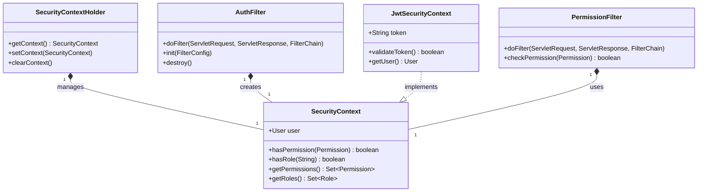

# RBAC Security Implementation

## Overview

The security implementation in openHAB Core provides a comprehensive framework for enforcing role-based access control. The system integrates with various authentication providers and implements security checks at multiple levels.

## Security Architecture



## Security Components

### Security Context
- Thread-local security information
- Contains current user and permissions
- Used for permission checking
- Provides role validation

### Authentication Filter
- Handles user authentication
- Creates security context
- Validates security tokens
- Manages user sessions

### JWT Security
- Token-based authentication
- Validates JWT tokens
- Extracts user information
- Manages token lifecycle

### Permission Filter
- Enforces permission checks
- Validates access rights
- Handles security exceptions
- Logs security events

## Implementation Examples

### Security Context Management

```java
public class SecurityContextManager {
    private static final ThreadLocal<SecurityContext> contextHolder = new ThreadLocal<>();
    
    public static void setContext(SecurityContext context) {
        contextHolder.set(context);
    }
    
    public static SecurityContext getContext() {
        return contextHolder.get();
    }
    
    public static void clearContext() {
        contextHolder.remove();
    }
}
```

### Authentication Filter

```java
public class AuthFilter implements Filter {
    @Override
    public void doFilter(ServletRequest request, ServletResponse response, FilterChain chain)
            throws IOException, ServletException {
        HttpServletRequest httpRequest = (HttpServletRequest) request;
        String token = httpRequest.getHeader("Authorization");
        
        if (token != null && token.startsWith("Bearer ")) {
            token = token.substring(7);
            JwtSecurityContext context = new JwtSecurityContext(token);
            if (context.validateToken()) {
                SecurityContextHolder.setContext(context);
            }
        }
        
        chain.doFilter(request, response);
        SecurityContextHolder.clearContext();
    }
}
```

### Permission Checking

```java
public class PermissionFilter implements Filter {
    @Override
    public void doFilter(ServletRequest request, ServletResponse response, FilterChain chain)
            throws IOException, ServletException {
        SecurityContext context = SecurityContextHolder.getContext();
        if (context == null) {
            throw new SecurityException("No security context");
        }
        
        if (!checkPermission(context, Permissions.READ.getPermission())) {
            throw new SecurityException("Insufficient permissions");
        }
        
        chain.doFilter(request, response);
    }
    
    private boolean checkPermission(SecurityContext context, Permission permission) {
        return context.hasPermission(permission);
    }
}
```

## Security Best Practices

1. Authentication
   - Use secure tokens
   - Validate credentials
   - Handle session timeouts
   - Implement rate limiting

2. Authorization
   - Check permissions early
   - Validate role assignments
   - Log security events
   - Handle security exceptions

3. Session Management
   - Use secure sessions
   - Implement timeouts
   - Clear security context
   - Monitor session usage

4. Error Handling
   - Log security failures
   - Return appropriate errors
   - Prevent information leakage
   - Handle edge cases

## Related Documentation

- [RBAC Overview](RBAC-Overview.md)
- [Permissions System](RBAC-Permissions.md)
- [Roles and Users](RBAC-Roles.md)
- [Development Guide](RBAC-Development.md) 